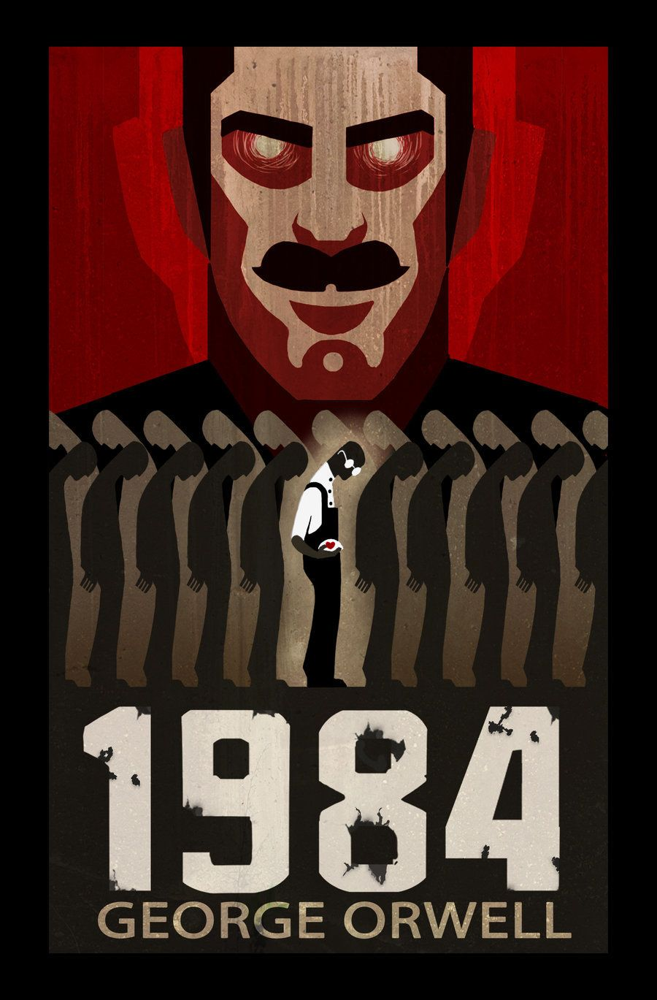

# Reads

> :books: Some of my favourite books that I would recommend.

Animal Farm - G. Orwell

1984 - G. Orwell

Brave New World - A. L. Huxley

Attack of the 50 foot Blockchain - D. Gerard

Algorithms to Live By - B. Christian

Homo Deus - Y. N. Harrari

The Signal And The Noise - N. Silver

Guns, Germs & Steel - J. Diamond

Why We Sleep - M. Walker

The Selfish Gene - R. Dawkins

Mendeliev's Dream: The Quest For The Elements - P. Strathern

Dictators Without Borders - A. Cooley & J. Heathershaw

The Art of Electronics - P. Horowitz & W. Hill

Gödel, Escher, Bach - D. Hofstadter

Rationality: From AI to Zombies - E. Yudkowsky

The Prince - N. Machiavelli 

Beyond Good and Evil - F. Nietzsche

Crime and Punishment - F. Dostoyevsky

The Art of War - S. Tzu

The Death of Ivan Ilyich - L. Tolstoy

Surely You're Joking, Mr. Feynman! - R. Feynman

